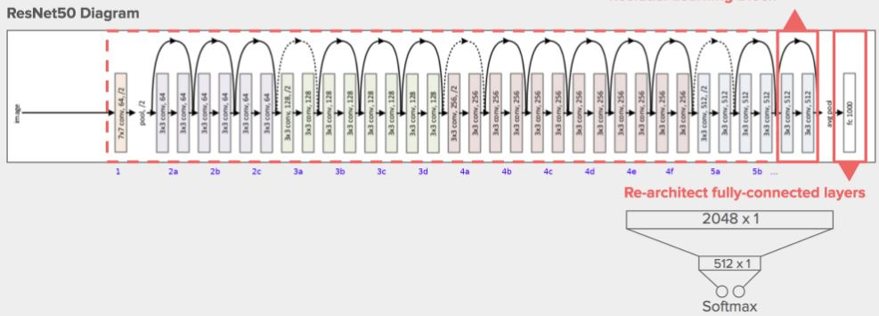

# Image Segmentation and Large Rock Detection on Artificial Lunar Landscape Dataset


## Abstract

On the lunar surface  a variety of different objects can be identified, including  rocks, mountains, boulders, slopes and mainly craters. Many studies have been conducted  in enriching our knowledge about the Moon and its surface. From the above mentionned characterstics of a lunar surface, large size rocks are an important threat for autonomous vehicles.

Therefore, the identification of large rocks on the lunar surface can contribute to a safer navigation for autonomus vehicles used for the lunar surface exploration. The objective of this project is the implementation of PyTorch's UNet Model and SegNet Model for Image Segmentation and Large Rock Detection on Artificial Lunar Landscape Dataset that is compatible with Intel® OpenVINO™

## Introduction

In space robotics particularly to the exploration of the moon, we rely on the power of lunar rovers, partially or fully autonomous vehicles that navigate on the surface of the moon. The obvious challenge on operating these vehicles is how we can safely navigate these into steep and rocky terrains. Like what Kobie Boykins, an engineer in JPL's spacecraft mechanical and engineering division said on his [2011 interview for Space.com](https://www.space.com/12482-moon-car-lunar-rover-apollo-15-legacy.html), we needed to then figure out how to drive over rocks and drive on steeper inclines. This could not have been any more true especially when these rovers are miles away from us, and we spend millions, if not billions for these space missions.

But this interview is about a decade ago. The very same year, we have had [incredible milestones towards deep learning and computer vision](forbes.com/sites/bernardmarr/2018/12/31/the-most-amazing-artificial-intelligence-milestones-so-far/#4968a43b7753) and these milestones kept pushing the limit as to what we can do across myriad of industries including space exploration. The year is 2020 as of this writing and so many deep learning applications are ready that we are now capable of improving these vehicles by aiding them with state-of-the-art computer vision models that would allow for detecting large rocks in a real-time fashion.

In this document, we will discuss the background and motivation of this study, the challenges that arise from creating a model for large rock detection which is part of smart navigation system we target the lunar rovers to have, how AI at the edge would help in solving these challenges and ultimately how we realized these lunar segmentation models by discussing the dataset, image segmentation techniques, model results and the end product using Intel® OpenVINO™ Toolkit.


## Background

The Trump administration is unequivocal in its pursuits of landing another man on the moon as well as building a sustainable infrastructure for long-term lunar and subsequently Martian explorations through its Artemis Program. The first bullet under Why Go to the Moon? section of [this](https://www.nasa.gov/what-is-artemis) article from NASA stipulates how this program will enable them to demonstrate new technologies, capabilities, and business approaches needed for future lunar exploration including Mars. 

In response to this, NASA itself [asks the general public and capable industries](https://www.nasa.gov/feature/nasa-to-industry-send-ideas-for-lunar-rovers) to send ideas on how to approach the development of robotic mobility systems and human-class lunar rovers to aid in conducting critical scientific research across wide areas of mostly unexplored lunar terrain. Within the same appeal article, Steve Clark, deputy associate administrator for exploration, Science Mission Directorate at NASA Headquarters in Washington said that “We are turning to industry to offer us exciting approaches to leverage existing systems here on Earth—including law enforcement, military, or recreational vehicles—that could be modified for use in space to enhance our mobility architecture.”

Another subset of Artemis Program is [Project VIPER](https://www.nasa.gov/feature/new-viper-lunar-rover-to-map-water-ice-on-the-moon) which aims to create a robust lunar rover that examines the presence of water on the moon in lieu with the aforesaid sustainability target. the rover will collect data on different kinds of soil environments, so obviously, this endeavor needs robust navigation systems especially when this exploration deals with uncharted terrains. 

In a research entitled [Robotics and Autonomous System by M.Novara P.Putz L.Maréchal S.Losito](https://www.sciencedirect.com/science/article/abs/pii/S092188909800058X), they stressed the importance of balance of autonomy and telepresence including the impact on technology development and operational costs, which are factors affecting robotics design. 


## Challenges
- Concept challenges:
The project we selected is by nature a challenging one. Since the moon terrain data is very difficult to be collected, the concept behind this research project is to use realistic artificial moon landscapes in order to match with the real ones. Aiming to address this challenge, deep learning and computer vision techniques were employed, in order to help lunar robots on landscape detection. In the current project we used a modified unet to create an edge App with openvino package. The unet model is scripted with pytorch framework.

- Technical challeges:
One important technical challenge we had to address, was the indirect compatibility between pytorch and OpenVINO package. The steps that we followed include the creation of the model using Pytorch, then the model is exported in ONNX format. Finally, a conversion of the ONNX model to OpenVINO, using Model Optimizer, is necessary. 

### How difficult it is to collect moon terrain data

As already mentioned, the lunar project, entails many difficulties. One of them was finding the appropriate dataset. As most planetary data, also moon terrain data are very sensitive and rare. This is attributed to two factors. The first one is related to the concept of a deep learning model. The need of big datasets is crucial in deep learning in order to achieve the optimal results. Therefore, in the case of moon terrain data, these big datasets are not applicable, as a robot is recording footsteps and this information is delivered to a satellite and afterwards to the robot's control center. The transfer speed is low and also time management is important as the robot should combine work and data transfer, thus a compromise between these two and a limitation in data, is inavoidable. The second restrictive factor is associated with the fact that our team is not a member of a space agency or an institution that would have a better access to an optimum sample of data. 

Deep learning and computer vision problems always rely on [vast amounts of data](https://www.ibm.com/topics/computer-vision) in order for the resulting models to be accurate. That is, in an acceptable degree of accuracy, resulting models capture the essence of what they represent or trying to solve. In our case, we want to have a feasible image segmentation model that can be applied to various use cases particularly in the creation of object detection or bounding box model to locate large boulders in real time fashion. In our case, only agencies like NASA are able to collect these sets of data like this dataset entitled [High-resolution Lunar Topography](https://pgda.gsfc.nasa.gov/products/54). Oftentimes, due to [limitations of the sensors and communication systems installed on these rovers](https://www.nasa.gov/mission_pages/LRO/news/LRO_twta.html) that capture significant amount terrain data and send lunar data periodically, data of interest is difficult to collect. 

Fortunately, there exists one labelled dataset of lunar landscape images that could be used for our purpose of employing machine learning approach to object detection or segmentation (see the dataset section of this document for more information about the dataset).

## Dataset

The dataset employed in the current project was created by the Ishigami Laboratory (Space Robotics Group) of Keio University, Japan which can accessed on [Kaggle](https://www.kaggle.com/romainpessia/artificial-lunar-rocky-landscape-dataset). In order the dataset to be realistic,  [NASA's LRO LOLA Elevation Model](https://astrogeology.usgs.gov/search/details/Moon/LRO/LOLA/Lunar_LRO_LOLA_Global_LDEM_118m_Mar2014/cub) was used. 

The digital elevation model (DEM) is based on data from the Lunar Orbiter Laser Altimeter (LOLA; Smith et al., 2010), an instrument on the National Aeronautics and Space Agency (NASA) Lunar Reconnaissance Orbiter (LRO) spacecraft (Tooley et al., 2010). The created DEM represents more than 6.5 billion measurements gathered between July 2009 and July 2013, adjusted for consistency in the coordinate system described below, and then converted to lunar radii (Mazarico et al., 2012). Elevations were computed by subtracting the lunar reference radius of 1737.4 km from the surface radius measurements (LRO Project and LGCWG, 2008; Archinal et al., 2011). 
Then the dataset creator used [Terragen 4](https://planetside.co.uk/) to render realistic CG lunar environment, based on the above mentioned DEM to extract elevation. 

The dataset currently contains 9,766 realistic renders of rocky lunar landscapes, and their segmented equivalents (the 3 classes are the sky, smaller rocks, and larger rocks). A table of bounding boxes for all larger rocks and processed, cleaned-up ground truth images are also provided. We recommend that users check the "Understanding and Using the Dataset" kernel which contains additional information on the dataset.


## Semantic Segmentation
The objective of Semantic image Segmentation is to classify each pixel of an image, based on what it represents. This procedure is repeated and applied in every single pixel of an image, thus this task is also known as dense prediction. Contrary to other techniques, like image classification, classification with localization and object detection, semantic segmentation provides a high resolution image, of the same size as the input image, where each picture corresponds to a specific class. Therefore, in semantic segmentation the output is not labels and box parameters, but a pixel by pixel classification.

####  Semantic Segmentation-Applications

Some applications of Semantic Segmentation can be summarized as follows:
- Autonomous vehicles
- Bio Medical Image Diagnosis
- Geo Sensing
- Precision Agriculture

## Large Rock Detection
Detecting large rocks in planetary images is crucial for planetary scientist and Geologists. 
Generally, identifying rocks in images of planetary surfaces is a very challenging task, 
mostly because rocks exhibit diverse morphologies, textures, colors, shape and other attributes that can be used to 
differentiate rocks from other features. In order, to solve this problem, we have tried several deep neural network architectures.
The architectures we tested and the design of our experiements are presented in the next section. 

## Challenges In Large Rock Detection

Training the model to get good results was a tough assignment as we could not get very accurate results. Subject to the fact that rocks do not have a uniform morphology, color, texture, shape and have no uniform property to distinguish them from background soil, it can be understood that rocks in planetary images are poorly suited for visual detection techniques. The problem becomes even more challenging when the planetary images are taken under different illumination conditions, viewing angles and so on. Furthermore, rocks can look blurred from a distance or partially embedded in the terrain because they are covered by dust and/or can occlude (hide) each other [1]

## Experimental Design
For the extraction and segmentation task at hand, we experimented with two key approaches.
- U-Net with ResNet encoder. For this, experimented with both ResNet-34 and ResNet-50 as encoder.
- SegNet.
We trained  models with Negative Log-Likelihood loss function for all experiments conducted  and also compared their performances using the Dice loss (defined in code below). We used used Stochastic Gradient Descent optimizer with parameters: learning rate = `0.01`, momentum = `0.9`, weight decay = `0.0001`. 

```
def dice_loss(inputs, labels):
    inputs = torch.argmax(inputs, dim=1, keepdim = True)
    inputs = inputs.squeeze(1)
    labels = labels.squeeze(1)
    intersection = (inputs.view(-1).float() == labels.view(-1).float())
    sum_int = intersection.sum().float()

    inp_flats = inputs.view(-1).float()
    lab_flats = labels.view(-1).float()    

    d_loss = (2 * sum_int/(len(inp_flats) + len(lab_flats)))
    return d_loss
```
We introduce all model architectures used in the immediate following sections below.

## ResNet
ResNet which is short for Residual Network is a type of specialized neural network that is well suited for sophisticated deep learning tasks. It has led to many break throughs in image classification and has received growing attention for its effectiveness for training deep networks. ResNet makes use of "skip connections" which are used to allow gradients to flow through a network directly, without passing through non-linear activation functions. This is a very important characteristic of this network, as it overcomes some problems of other deep neural networks like "vanishing gradient" problem which occurs when gradients become too small to be immediately useful. In addition, it prevents overfitting, where models learn intricate details from training data that prevent them from generalizing enough unseen data. By utilizing deep residual learning frameworks, we could harness the power of deep networks and minimize the weaknesses.

#### Why ResNet
- Won 1st place in the ILSVRC 2015 classification competition with top-5 error rate of 3.57% (An ensemble model)
- Won the 1st place in ILSVRC and COCO 2015 competition in ImageNet Detection, ImageNet localization, Coco detection and Coco segmentation.
- Another important factor for choosing this model is the energy efficiency factor. This factor with the combination of robot hardware is the most crucial part since the robot is using solar panels and batteries to be operational. Also with the combination of the model's energy efficiency factor and the Movidius Neural Compute Stick(2) energy efficiency factor we can have operations lower than 1.5 Watts.

The Myriad X is power efficient using just about 1.5 Watts, but it can still process up to 4 trillion operations per second. It has 16 vector processors optimized for image processing pipelines and computer vision workloads.


##### ResNet-34
ResNet-34 is a 34 layer deep convolutional neural network that is pretrained on the ImageNet database which contains more the one million images. Each ResNet block in this topology is 2-layers deep.

*ResNet-34 topology*

##### ResNet-50
ResNet-50 is a 50 layer deep convolutional neural network that is pretrained on the ImageNet database which contains more the one million images. Each ResNet block in this topology is 3-layers deep. It is has been shown to provide better results than ResNet34 but comes with more computational burden due to the extra layers and parameters.

*ResNet-50 topology. Source: https://roamerworld.blogspot.com/2019/05/resnet50-architecture-for-deep-learning_24.html*

## U-Net 
#### Why U-Net
There are several advantages in using U-Net for our project. First of all, considering the limited dataset sample we were dealing with, U-net provided the optimal results, as it has been tested as a segmentation tool in projects with small datasets, e.g. less than 50 training samples. Second, an also important feature of U-net is that it can be used with large images datasets, as it does not have any fully connected layers. Owing to this characteristic, features from images with different sizes, can be extracted. Summing the above benefits and considering the limitations we faced with our dataset, U-net was selected as the ideal segmentation tool for our lunar project.

#### U-Net Topology
As mentioned above, in the current project, we used U-Net Topology for Semantic Segmentation. Olaf Ronneberger et al. developed this model for Bio Medical Image Segmentation. The model's architecture is divided in two sections. The utility of the first part, also known as the contraction path (encoder), is to capture the context in the image. The encoder consists of convolutional and max poolong layers. The second part, also known as the decoder is responsible for the precise localization , with the use of transposed convolutions. It is a fully convolutional network, which consists of convolutional layers, without any dense layer, which enables it to accept images of any size. Upsampling operators that replace pooling operations, increase the resolution of the output. The prediction of the pixels in the border region of the image, is achived by extrapolating the missing context, by mirroring the input image. This tiling strategy enables the application of the network to large images, since otherwise the resolution would be limited by the GPU memory. To improve the performance of our segmentation model, we used pretrained ResNet for the encoder/down sampling section of the U-Net

*U-Net Topology*


## SegNet


#### SegNet Topology
SegNet is a deep encoder-decoder architecture for multi-class pixelwise segmentation researched and developed by members of the Computer Vision and Robotics Group at the University of Cambridge, UK.

The selection of SegNET topology was based on the encoder network, which is identical to the convolutional layers in VGG16. This type of encoder is smaller and easier to train compared to other architectures, as the fully connected layers of VGG16 are removed. The main characteristic of SegNet is the decoder network, which consists of an hierarchy of decoders one corresponding to each encoder. 

Of these, the appropriate decoders use the max-pooling indices received from the corresponding encoder to perform non-linear upsampling of their input feature maps. This has the important advantages of retaining high frequency details in the segmented images and also reducing the total number of trainable parameters in the decoders. The entire architecture can be trained end-to-end using stochastic gradient descent. The raw SegNet predictions tend to be smooth even without a CRF based post-processing [2].

The advantages of re-using max-pooling indices in the decoding process can be summarized as follows:
1. Boundary delineation is improved
2. It reduces the number of parameters enabling end-to-end training


#### Why SegNet

From a computational perspective, it is necessary for the network to be efficient in terms of both memory and computation time during inference. The selection of SegNet initially was based on the low memory requirement during both training and testing, as well as the high FPS. Another advantage is the size of the model, which is significantly smaller that FCN and DeconvNet. Segmentation resolution is improved by transferring maxpooling indices to decoder. Also, the fully connected layers can be discarded in favour of retaining higher resolution feature maps at the deepest encoder output, a fact that reduces the number of parameters in the SegNet encoder network significantly (from 134M to 14.7M) as compared to other architectures [2].

One difference between SegNet and U-Net, is that the latter does not reuse pooling indices but instead transfers the entire feature map (at the cost of more memory) to the corresponding decoders and concatenates them to upsampled (via deconvolution) decoder feature maps. U-Net has no conv5 and max-pool 5 block, as in the VGG net architecture. SegNet, on the other hand, uses all of the pre-trained convolutional layer weights from VGG net as pre-trained weights. U-Net, which is widely used in biomedical image segmentation, instead of using pooling indices, the entire feature maps are transfer from encoder to decoder, then with concatenation to perform convolution.
This procedure makes the model larger and more memory is required.


## The novelty of our project: How to make these models usable

Especially when we want to use the model locally on lunar rovers, it is obviously infeasible to run predictions to the cloud and get back to the rover. That is why real-time processing is necessary for applications such as these. In our case, our model must be accurate and fast enough to spit out predictions locally. Not to mention the issue of [energy efficiency](https://www.researchgate.net/publication/332463258_Low-Power_Computer_Vision_Status_Challenges_Opportunities) when it comes to building a pipelined approach in realizing these powerful systems. 

To overcome these challenges, we need to have a toolkit that solves these problems while also proactively support frameworks that produces state-of-the-art segmentation models that fit our purpose. 


## AI at the Edge and The Intel® OpenVINO™ Toolkit

In response to the need for robust yet low-powered solutions for computer vision tasks that can be installed as an auxiliary system for autonomous systems, Intel released the OpenVINO toolkit to enable developers to do just that. Per the [documentation](https://software.intel.com/en-us/openvino-toolkit), OpenVINO enables deep learning inference right within edge, accelerates AI workloads, including computer vision with open support for many computer vision libraries such as OpenCV, OpenCL™, and other industry frameworks and libraries like PyTorch, Caffe, and TensorFlow.

This is beneficial for our purpose since our model which was written using PyTorch, needs to be converted into a system in such a way that it can run without cloud supervision, can be optimized using Intel hardware which are [currently being used by these autonomous vehicles for their computation requirements](https://newsroom.intel.com/news/intel-hosts-nasa-frontier-development-lab-demo-day-2018-research-presentations/#gs.xf1snl).


## Results

### Segmentation Results

### U-Net-ResNet18
#### Untrained model


#### Results after training
### U-Net-Resnet18
##### Example1 - input/ground truth/prediction


##### Example2 - input/ground truth/prediction


##### Example3 - input/ground truth/prediction


##### Real moon prediction - input/prediction


### U-Net-Resnet50
##### Example1 - input/ground truth/prediction


##### Example2 - input/ground truth/prediction


##### Real moon prediction - input/prediction


### SegNet
##### Example1 - input/ground truth/prediction


##### Example2 - input/ground truth/prediction


#### Real moon prediction - input/prediction
##### Example1 - input/ground truth/prediction


##### Example2 - input/ground truth/prediction


### Openvino Video presentation


[Segmentation Demo-Video](https://github.com/geochri/lunar-segmentation-openvino/blob/master/video/demo.mp4)

### Large Rock Detection Results


The figure below shows the training and validation loss.


## Further work
We will implementing and testing more segmentation models such as ENet and ICNet on openvino.

## Contributors

George Christopoulos - https://github.com/geochri

Alexander Villasoto  - https://github.com/anvillasoto

Ayivima              - https://github.com/ayivima

Ivy                  - https://github.com/ivyclare

Zik                  - https://github.com/dimejimudele


## References
1) Thompson, D. R., Castano, R., 2007. Performance Comparison of Rock Detection Algorithms for Autonomous Planetary Geology. Aerospace, IEEE, USA, IEEEAC Paper No.1251

2) V. Badrinarayanan, A. Kendall and R. Cipolla, "SegNet: A Deep Convolutional Encoder-Decoder Architecture for Image Segmentation," in IEEE Transactions on Pattern Analysis and Machine Intelligence, vol. 39, no. 12, pp. 2481-2495, 1 Dec. 2017. URL: https://arxiv.org/pdf/1511.00561.pdf
